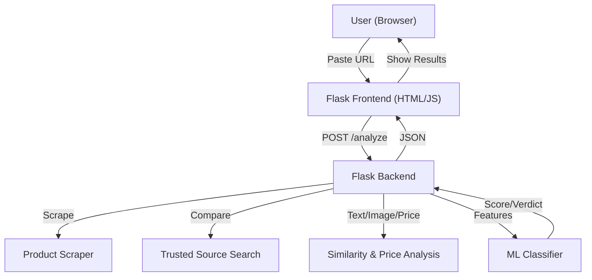

# Fake Product Detector (India)

A free, modern web app to detect potentially fake or scam products sold online in India. Paste any product URL to get an analysis comparing it to reputable marketplaces.

---

## Screenshot


---

## Architecture



---

## How to Use

1. Paste a product URL from any Indian e-commerce site.
2. Click 'Check'.
3. Wait for the analysis (a few seconds).
4. View the verdict, authenticity score, and detailed breakdown.
5. Download or copy the result for your records.

---

## How it Works

- Scrapes product details (title, price, images, seller, etc.)
- Compares with trusted sources (Amazon, Flipkart, etc.)
- Calculates text/image similarity, price deviation, and seller credibility
- ML model predicts authenticity and gives a verdict
- All processing is local and privacy-friendly

---

## Features
- Paste any product URL for analysis
- Scrapes product details (title, description, price, images, seller)
- Compares with trusted Indian e-commerce sites (Amazon, Flipkart, Snapdeal, Tata Cliq, Reliance Digital)
- Text and image similarity, price deviation, seller credibility
- Machine learning-based authenticity score and verdict
- Clean, responsive web UI (Bootstrap, dark mode, PDF export)
- Free/open-source libraries only

## Tech Stack
- Frontend: HTML, CSS, Bootstrap, JavaScript
- Backend: Flask (Python)
- Scraping: requests, BeautifulSoup, Selenium
- NLP: spaCy, sentence-transformers
- Image: imagehash, Pillow
- ML: scikit-learn

## Setup & Local Deployment

1. **Clone the repo:**
   ```bash
   git clone <repo-url>
   cd fake-product-detector
   ```
2. **Install dependencies:**
   ```bash
   pip install -r requirements.txt
   ```
3. **Run the app:**
   ```bash
   python app.py
   ```
4. **Open in browser:**
   Visit [http://127.0.0.1:5000](http://127.0.0.1:5000)

## Notes
- This is a demo/prototype. Real scraping and analysis logic should be implemented for production.
- No paid APIs or subscriptions required.
- Can be deployed on Streamlit Cloud, Heroku, Render, or run locally.

---

**Made for Indian e-commerce safety!** 